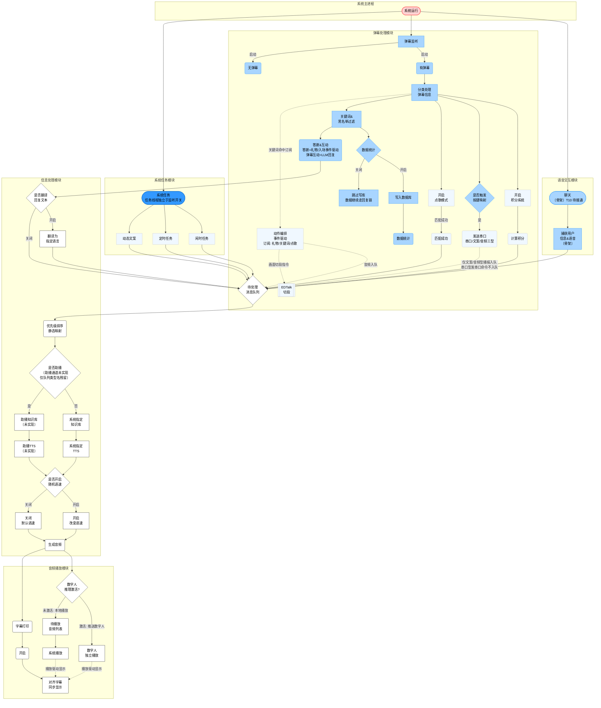

```mermaid
flowchart TD
    %% ==================== 主干图 v2（2026-10-22 裁决批次 main-20261022-161815，终门 rec 全推荐批准） ====================
    %% 本图为主干图（人读、随批次维护）；工程锚点与前提表见 docs/flowchart-detail.md（只读历史归档，锚点截至基线 commit dcf1ea51，不持续维护）
    %% 图例（四态）: 〔真实〕运行链在用 ｜ 〔断链〕代码在但链路断开（出现即开批次修复）｜ 〔骨架〕框架在实现空 ｜ 〔规划〕未开发占位
    %% 纪律: ①改链必改图（改消息链/播放链代码的提交须同步检查本图对应节点/边）②改图必开批次（用户改图=变更请求草稿，进入 /autoplan 裁决入口，不直接代码对齐）
    %% 终门裁决（2026-10-22 rec）: uc1a 任务调度独立于监听开关｜uc2a 过滤后写库=目标态(代码实施=独立批次)｜uc3a 翻译入队前(回复文本)｜uc4a 编排=事件订阅非主链｜uc5a 互斥两路+字幕从属｜d2a 节点语义修正+四态图例
    %% 样式定义
    classDef startNode fill:#FFD3D3,stroke:#FF6666,stroke-width:2px,color:#000;
    classDef listenNode fill:#A8D5FF,stroke:#3399FF,stroke-width:1px,color:#000;
    classDef sysTaskNode fill:#3399FF,stroke:#0066CC,stroke-width:1px,color:#000;
    classDef processNode fill:#D9EDFF,stroke:#99CCFF,stroke-width:1px,color:#000;
    classDef logicNode fill:#FFFFFF,stroke:#333333,stroke-width:1px,color:#000;
    classDef subLogicNode fill:#F0F8FF,stroke:#CCCCCC,stroke-width:1px,color:#000;
    classDef endNode fill:#F4F4F5,stroke:#999999,stroke-width:1px,color:#000;

    %% 根流程
    subgraph 系统主进程
        System([系统运行]):::startNode
    end

    %% 子流程：聊天模块
    subgraph 语音交互模块
        System --> Chat([聊天<br>〔骨架〕T10 待接通]):::listenNode
        Chat --> Capture[捕获用户<br>信息&语音<br>〔骨架〕]:::listenNode
        %% 裁决(差异D7): conversation_manager 空框架（T10 断链，TODOS 锚定"断链批次后下一批"）
    end

    %% 子流程：弹幕监听与消息队列
    subgraph 弹幕处理模块
        System --> Listening[弹幕监听]:::listenNode
        Listening --> |启动|HasDM(有弹幕):::listenNode
        Listening --> |启动|NoDM(无弹幕):::listenNode
        HasDM --> Classify[分类处理<br>弹幕信息]:::listenNode
        Classify --> Points[开启<br>积分系统]:::subLogicNode
        Classify --> Keymap{是否触发<br>按键映射}:::listenNode
        Classify --> SongMode[开启<br>点歌模式]:::subLogicNode
        Classify --> Filter[关键词&<br>黑名单过滤]:::listenNode

        Points --> Calc(计算积分):::subLogicNode
        Calc --> Queue
        %% 裁决(差异D14,重扫新增): 积分档位播报出边——旧图 F5 已修正、重绘时丢失，补边恢复（积分回复进播放链）

        Keymap --> |是| SendPort(发送串口<br>串口/文案/音频三型):::subLogicNode
        SongMode --> |匹配成功|Match(匹配成功):::subLogicNode

        Filter --> Stats{数据统计}:::listenNode
        Stats --> |开启| DB[写入数据库]:::listenNode
        Stats --> |关闭| Ignore[跳过写库<br>数据继续走回复链]:::listenNode
        DB --> Result(数据统计):::listenNode
        %% 裁决(uc2a/差异D2): 图=目标态"过滤后写库"（违禁弹幕不入库）；当前代码=写库先于过滤（F9），代码实施=独立批次（TODOS 2026-10-22 节，前置=comment_handler 在飞改动落地）

        Filter --> Interact(答谢&互动<br>答谢=礼物/入场事件驱动<br>弹幕互动=LLM回复):::listenNode
        %% 裁决(差异D11): 答谢真实事件源=event_handler 礼物/入场事件生产+timer_handler 消费；弹幕侧互动=LLM 回复

        %% 动作编排（事件订阅，非主链）
        Classify -.->|关键词命中订阅| Choreo[动作编排<br>事件驱动<br>订阅: 礼物/关键词/点歌]:::subLogicNode
        Choreo -.->|音频入队| Queue
        Choreo -.->|画面切段指令| EDTalkSeg[[EDTalk<br>切段]]:::subLogicNode
        %% 裁决(uc4a/差异D5): 编排器=事件订阅三点（choreographer.py gift/keyword/song），不在 TTS 主链——原主链必经画法已修正
    end

    %% 子流程：系统任务
    subgraph 系统任务模块
        System --> SystemTasks([系统任务<br>任务线程独立于监听开关]):::sysTaskNode
        Idle[闲时任务]:::subLogicNode
        Timed[定时任务]:::subLogicNode
        DynamicCopy[动态文案]:::subLogicNode
        SystemTasks --> Idle
        SystemTasks --> Timed
        SystemTasks --> DynamicCopy
        %% 裁决(uc1a/差异D1): 原"Listening→|关闭|SystemTasks"为 F2 已证伪结构——任务调度线程自启，与监听开关无关
    end

    %% 核心处理流程
    subgraph 信息处理模块
        Queue{待处理<br>消息队列}:::logicNode
        Capture --> Queue
        DynamicCopy --> Queue
        SendPort -.->|仅文案/音频型播报入队<br>串口型发串口命令不入队| Queue
        Match --> Queue
        Interact --> TranslateQ{是否翻译<br>回复文本}:::logicNode
        TranslateQ --> |开启| Translate[翻译为<br>指定语言]:::logicNode
        TranslateQ --> |关闭| Queue
        Translate --> Queue
        Idle --> Queue
        Timed --> Queue
        %% 裁决(uc3a/差异D4-翻译): 翻译在入队前执行（F14）——对象=待播报的回复文本（comment_handler.py:378→:408）；点歌音频不经翻译
        %% 裁决(差异D10): SendPort 三触发器分流——串口型发串口命令不入队；文案/音频型产生播报入队

        Queue --> Sort(优先级排序<br>静态映射):::logicNode
        %% 裁决(差异D4-Sort): 入队时静态优先级映射（queue_manager priority_mapping），非动态排序（F12）
        Sort --> KBQ{是否助播<br>〔助播通道未实现<br>仅队列类型名残留〕}:::logicNode
        KBQ --> |否|SysKB[系统指定<br>知识库]:::logicNode
        KBQ --> |是|AsstKB[助播知识库<br>〔未实现〕]:::logicNode
        SysKB --> SysTTS[系统指定<br>TTS]:::logicNode
        AsstKB --> AsstTTS[助播TTS<br>〔未实现〕]:::logicNode
        SysTTS --> SpeedQ{是否开启<br>随机语速}:::logicNode
        AsstTTS --> SpeedQ
        SpeedQ --> |开启|ChangeSpeed[开启<br>改变语速]:::logicNode
        SpeedQ --> |关闭|DefaultSpeed[关闭<br>默认语速]:::logicNode
        ChangeSpeed --> GenerateAudio(生成音频):::logicNode
        DefaultSpeed --> GenerateAudio
        %% 裁决(差异D6): 助播生产端零调用（assistant_anchor_* 仅队列类型名+消费分支）；2026-10-20 终门 d2a 裁决=标注不删除
        %% 裁决(差异D9): 随机语速=TTS 合成内部 speed_factor（my_tts.py），SpeedQ 节点保留对齐认可
    end

    %% 输出与播放模块
    subgraph 音频播放模块
        GenerateAudio --> AvatarAI{数字人<br>推理激活?}:::logicNode
        AvatarAI --> |激活: 推送数字人|AvatarPlay[数字人<br>独立播放]:::logicNode
        AvatarAI --> |未激活: 本地播放|AudioList[待播放<br>音频列表]:::logicNode
        AudioList --> SystemPlay[系统播放]:::logicNode
        GenerateAudio --> Subtitle(字幕打印):::logicNode
        Subtitle --> SubOpen(开启):::logicNode
        SubOpen --> Sync[对齐字幕<br>同步显示]:::logicNode
        AvatarPlay -.->|播放驱动显示| Sync
        SystemPlay -.->|播放驱动显示| Sync
        %% 裁决(uc5a/差异D8): 互斥两路（playback_manager.py:109 is_edtalk_active 分流——激活=推送跳过本地播放）+字幕从属（由播放/推送驱动，F20 字幕不驱动播放）；原"三路并存+Sync→播放"为 F18/F20 已证伪结构
    end
```
