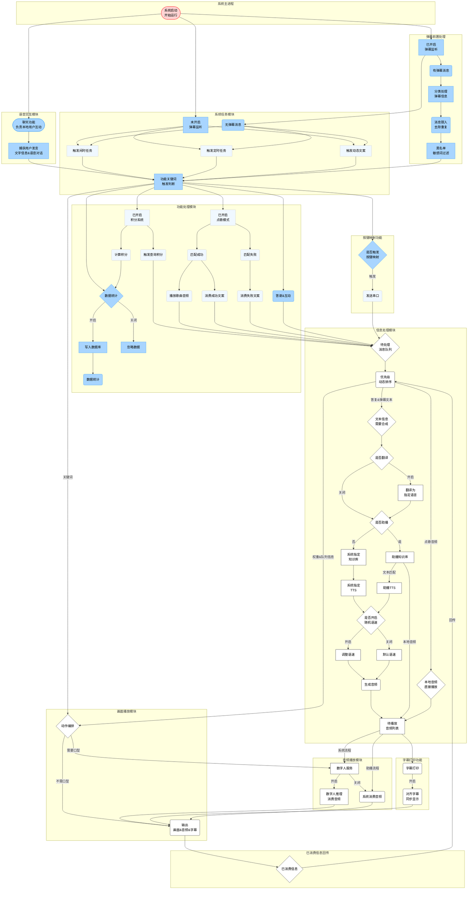

```mermaid
flowchart TD
    %% ==================== 主干图元数据 ====================
    %% 版本：v2.6 —— 2026-10-27 动作编排完善批次（用户终版手改 v2.5 基础上重落盘：新增 Sort→|权重&队列信息|Compile 权重联动边与「已消费信息回传」子图 Frame→lineout→|回传|Sort；编排上级=Keyword 关键词触发+Sort 权重排序双入，切换方式=无缝/立刻，打队模式=打断/排队；代码侧 utils/orchestration/）
    %% 图例：四态语义〔真实/断链/骨架/规划〕v1 定义见 docs/flowchart-detail.md（归档详图）；行号为书写时参考，随重构过期以符号名为准
    %% 纪律：改链必改图 —— 对应批次须同步检查本图节点/边（TODOS 2026-10-20 节 #5；tests/test_flowchart_alignment.py 守卫）
    %% 样式定义
    classDef startNode fill:#FFD3D3,stroke:#FF6666,stroke-width:2px,color:#000;
    classDef listenNode fill:#A8D5FF,stroke:#3399FF,stroke-width:1px,color:#000;
    classDef sysTaskNode fill:#3399FF,stroke:#0066CC,stroke-width:1px,color:#000;
    classDef processNode fill:#D9EDFF,stroke:#99CCFF,stroke-width:1px,color:#000;
    classDef logicNode fill:#FFFFFF,stroke:#333333,stroke-width:1px,color:#000;
    classDef subLogicNode fill:#F0F8FF,stroke:#CCCCCC,stroke-width:1px,color:#000;
    classDef endNode fill:#F4F4F5,stroke:#999999,stroke-width:1px,color:#000;

    %% 主线程
    subgraph 系统主进程
        System([系统启动<br>开始运行]):::startNode
    end

    %% 聊天模块
    subgraph 语音交互模块
        System --> Chat([聊天功能<br>负责本地用户互动]):::listenNode
        Chat --> Capture[捕获用户发言<br>文字信息&语音对话]:::listenNode
    end

    %% 系统任务
    subgraph 系统任务模块
        System --> Listenoff[未开启 <br> 弹幕监听]:::listenNode
        Listenoff --> Idle[触发闲时任务]:::subLogicNode
        Listenoff --> Timed[触发定时任务]:::subLogicNode
        Listenoff --> DynamicCopy[触发动态文案]:::subLogicNode
        NoDM --> Idle
        NoDM --> Timed
        NoDM --> DynamicCopy
        Capture --> Keyword
        Idle --> Keyword
        Timed --> Keyword
        DynamicCopy --> Keyword        
    end

    %% 按键映射
    subgraph 按键映射功能
        Keyword --> Keymap{是否触发<br>按键映射}:::listenNode
        Keymap --> |触发| SendPort(发送串口):::subLogicNode        
    end

    %% 弹幕处理流程
    subgraph 弹幕前置处理
        System --> Listening[已开启 <br> 弹幕监听]:::listenNode
        Listening --> NoDM(无弹幕消息):::listenNode
        Listening --> HasDM(有弹幕消息):::listenNode
        HasDM --> Classify[分类处理<br>弹幕信息]:::listenNode
        Classify --> Door(消息限入<br>去除重复):::listenNode
        Door --> Filter[黑名单<br>敏感词过滤]:::listenNode
    end

    %% 功能触发
    subgraph 功能处理模块
        Filter --> Keyword[功能关键词<br>触发判断]:::listenNode
        Keyword --> SongMode[已开启<br>点歌模式]:::subLogicNode
        SongMode --> Match(匹配成功):::subLogicNode
        Match --> done(消费成功文案):::subLogicNode
        Match  --> sing(播放歌曲音频):::subLogicNode
        SongMode --> miss(匹配失败):::subLogicNode
        miss --> misMatch(消费失败文案):::subLogicNode
        Keyword --> Points[已开启<br>积分系统]:::subLogicNode
        Points --> Calc(计算积分):::subLogicNode
        Keyword --> Stats{数据统计}:::listenNode
        Calc --> Stats
        Points --> look(触发查询积分):::subLogicNode
        
        
        Stats --> |开启| DB[写入数据库]:::listenNode
        Stats --> |关闭| Ignore[忽略数据]:::listenNode
        DB --> Result(数据统计):::listenNode
        Keyword --> Interact(答谢&互动):::listenNode
        
    end

    %% 核心处理流程
    subgraph 信息处理模块
        Queue{待处理<br>消息队列}:::logicNode
        look --> Queue
        SendPort --> Queue
        sing --> Queue
        done --> Queue
        misMatch --> Queue
        Interact --> Queue
        Queue --> Sort(优先级<br>动态排序):::logicNode
        Sort --> |答复&弹幕文本|text{文本信息<br>需要合成}:::logicNode
        Sort --> |点歌音频|file{本地音频<br>直接播放}:::logicNode
        text --> TranslateQ{是否翻译}:::logicNode
        TranslateQ --> |开启| Translate[翻译为<br>指定语言]:::logicNode
        TranslateQ --> |关闭| KBQ{是否助播}:::logicNode
        Translate --> KBQ
        KBQ --> |否|SysKB[系统指定<br>知识库]:::logicNode
        KBQ --> |是|AsstKB[助播知识库]:::logicNode
        SysKB --> SysTTS[系统指定<br>TTS]:::logicNode
        AsstKB --> |文本匹配|AsstTTS[助播TTS]:::logicNode
        SysTTS --> SpeedQ{是否开启<br>随机语速}:::logicNode
        AsstTTS --> SpeedQ
        SpeedQ --> |开启|ChangeSpeed[调整语速]:::logicNode
        SpeedQ --> |关闭|DefaultSpeed[默认语速]:::logicNode
        ChangeSpeed --> GenerateAudio(生成音频):::logicNode
        DefaultSpeed --> GenerateAudio
        GenerateAudio --> AudioList[待播放<br>音频列表]:::logicNode
        AsstKB --> |本地音频|AudioList
        file --> AudioList
    end 
    %% 字幕打印
    subgraph 字幕打印功能
        AudioList --> Subtitle(字幕打印):::logicNode
        Subtitle --> |开启|Sync(对齐字幕<br>同步显示):::logicNode 
    end       
    %% 输出与播放模块
    subgraph 音频播放模块
        AvatarAI --> |关闭|SystemPlay(系统消费音频):::logicNode
        AudioList --> |助播流程|SystemPlay
        AudioList --> |系统流程|AvatarAI[数字人服务]:::logicNode
        AvatarAI --> |开启|AvatarPlay[数字人推理<br>消费音频]:::logicNode

    end
    %% 画面输出模块
    subgraph 画面播放模块  
        Keyword --> |关键词|Compile{动作编排}:::logicNode
        Sort --> |权重&队列信息|Compile
        Frame(输出<br>画面&音频&字幕):::logicNode      
        Compile --> |需要口型|AvatarAI
        Compile --> |不需口型|Frame
        AvatarPlay --> Frame
        Sync --> Frame
        SystemPlay --> Frame
    end    

    %% 消费完成
    subgraph 已消费信息回传 
        Frame --> lineout{已消费信息}:::logicNode
        lineout --> |回传|Sort
    end    
```