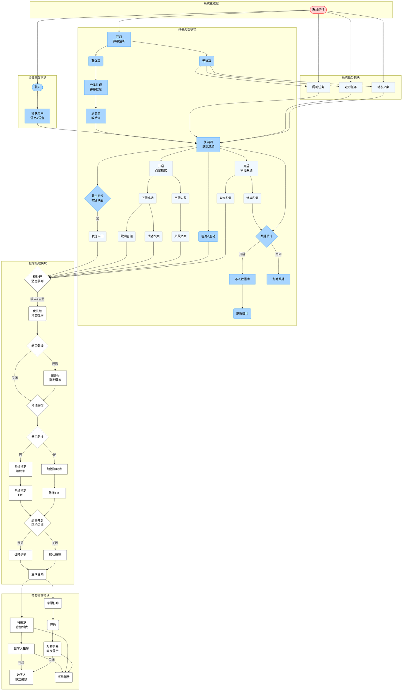

```mermaid
flowchart TD
    %% 样式定义
    classDef startNode fill:#FFD3D3,stroke:#FF6666,stroke-width:2px,color:#000;
    classDef listenNode fill:#A8D5FF,stroke:#3399FF,stroke-width:1px,color:#000;
    classDef sysTaskNode fill:#3399FF,stroke:#0066CC,stroke-width:1px,color:#000;
    classDef processNode fill:#D9EDFF,stroke:#99CCFF,stroke-width:1px,color:#000;
    classDef logicNode fill:#FFFFFF,stroke:#333333,stroke-width:1px,color:#000;
    classDef subLogicNode fill:#F0F8FF,stroke:#CCCCCC,stroke-width:1px,color:#000;
    classDef endNode fill:#F4F4F5,stroke:#999999,stroke-width:1px,color:#000;

    %% 根节点
    subgraph 系统主进程
        System([系统运行]):::startNode
    end

    %% 聊天模块
    subgraph 语音交互模块
        System --> Chat([聊天]):::listenNode
        Chat --> Capture[捕获用户<br>信息&语音]:::listenNode
    end

    %% 弹幕监听与消息队列
    subgraph 弹幕处理模块
        System --> Listening[开启 <br> 弹幕监听]:::listenNode
        Listening --> HasDM(有弹幕):::listenNode
        Listening --> NoDM(无弹幕):::listenNode
        Classify --> Filter[黑名单<br>敏感词]:::listenNode
        Filter --> Keyword[关键词<br>识别过滤]:::listenNode
        HasDM --> Classify[分类处理<br>弹幕信息]:::listenNode
        Keyword --> Keymap{是否触发<br>按键映射}:::listenNode
        Keyword --> SongMode[开启<br>点歌模式]:::subLogicNode
        Keyword --> Points[开启<br>积分系统]:::subLogicNode
        Points --> Calc(计算积分):::subLogicNode
        Points --> look(查询积分):::subLogicNode
        Keymap --> |是| SendPort(发送串口):::subLogicNode
        SongMode --> Match(匹配成功):::subLogicNode
        Match --> done(成功文案):::subLogicNode
        Match  --> sing(歌曲音频):::subLogicNode
        SongMode --> miss(匹配失败):::subLogicNode
        miss --> misMatch(失败文案):::subLogicNode

        Calc --> Stats
        Keyword --> Stats{数据统计}:::listenNode
        Stats --> |开启| DB[写入数据库]:::listenNode
        Stats --> |关闭| Ignore[忽略数据]:::listenNode
        DB --> Result(数据统计):::listenNode

        Keyword --> Interact(答谢&互动):::listenNode

    end

    %% 系统任务
    subgraph 系统任务模块
        Idle[闲时任务]:::subLogicNode
        Timed[定时任务]:::subLogicNode
        DynamicCopy[动态文案]:::subLogicNode
        System --> Idle
        System --> Timed
        System --> DynamicCopy
        NoDM --> Idle
        NoDM --> Timed
        NoDM --> DynamicCopy
    end

    %% 核心处理流程
    subgraph 信息处理模块
        Queue{待处理<br>消息队列}:::logicNode
        Capture --> Keyword
        Idle --> Keyword
        Timed --> Keyword
        DynamicCopy --> Keyword
        SendPort --> Queue
        sing --> Queue
        done --> Queue
        misMatch --> Queue
        Interact --> Queue
        look --> Queue
        Queue --> |限入&去重|Sort(优先级<br>动态排序):::logicNode
        Sort --> TranslateQ{是否翻译}:::logicNode
        TranslateQ --> |开启| Translate[翻译为<br>指定语言]:::logicNode
        TranslateQ --> |关闭| Compile{动作编排}:::logicNode
        Translate --> Compile
        Compile --> KBQ{是否助播}:::logicNode
        KBQ --> |否|SysKB[系统指定<br>知识库]:::logicNode
        KBQ --> |是|AsstKB[助播知识库]:::logicNode
        SysKB --> SysTTS[系统指定<br>TTS]:::logicNode
        AsstKB --> AsstTTS[助播TTS]:::logicNode
        SysTTS --> SpeedQ{是否开启<br>随机语速}:::logicNode
        AsstTTS --> SpeedQ
        SpeedQ --> |开启|ChangeSpeed[调整语速]:::logicNode
        SpeedQ --> |关闭|DefaultSpeed[默认语速]:::logicNode
        ChangeSpeed --> GenerateAudio(生成音频):::logicNode
        DefaultSpeed --> GenerateAudio
    end
    %% 输出与播放模块
    subgraph 音频播放模块
        GenerateAudio --> AudioList[待播放<br>音频列表]:::logicNode
        GenerateAudio --> Subtitle(字幕打印):::logicNode
        AudioList --> AvatarAI[数字人推理]:::logicNode
        AvatarAI --> |开启|AvatarPlay[数字人<br>独立播放]:::logicNode
        AvatarAI --> |关闭|SystemPlay[系统播放]:::logicNode
        

        
        Subtitle --> SubOpen(开启):::logicNode
        SubOpen --> Sync(对齐字幕<br>同步显示):::logicNode
        
        AudioList --> SystemPlay(系统播放):::logicNode
        Sync --> SystemPlay
        Sync --> AvatarPlay
    end    
```
