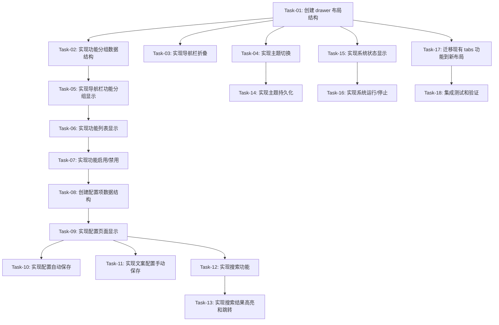

# 前端优化 — 开发任务计划

## 1. 任务概览

**总任务数**：18 个
**预计总工时**：约 16 小时
**开发方法**：TDD — 每个任务按 RED → GREEN → REFACTOR 循环执行

**关键标注**：
- 🔒 阻塞任务：被多个任务依赖，建议优先完成
- ⚠️ 风险任务：技术难度高，可能需要额外时间

**前置说明**：
- 当前前端使用 `ui.tabs()` 顶部标签页布局（14 个功能标签）
- 需求要求重构为 `ui.drawer()` 左侧导航栏 + 三级页面布局
- 已有可复用组件：ThemeManager、SearchFilter、ControlButtons、FormField 等
- 功能分组需要从现有 tabs 重新组织为 5 个分组

### 依赖关系图

### 可并行任务组

| 并行组 | 任务 | 说明 |
|--------|------|------|
| 组 1 | Task-02, Task-03, Task-04 | 都依赖 Task-01，可并行开发 |
| 组 2 | Task-10, Task-11, Task-12 | 都依赖 Task-09，可并行开发 |
| 组 3 | Task-14, Task-15 | 分别依赖 Task-04 和 Task-01，可并行开发 |

---

## 2. 开发任务

> 按垂直切片组织。每个阶段对应一个可独立运行和验证的用户行为（加可选的基础设施层）。切片内部的任务按技术层自然顺序排列。
>
> 每个任务按 TDD 循环执行：RED（根据验证标准写测试）→ GREEN（写最小实现通过测试）→ REFACTOR（重构）

### 阶段 0：基础设施（创建新的 drawer 布局结构）

**阶段完成标准**：创建新的 drawer 布局结构，为后续功能开发提供基础框架。

---

#### Task-01: 创建 drawer 布局结构 🔒

**通俗解释**：用户打开网页，可以看到左侧有一个可折叠的导航栏，右边是内容区，整体布局清晰美观。

**做什么**：
- 创建新的 `ui.drawer()` 左侧导航栏
- 创建 `ui.splitter()` 中间功能列表 + 右侧配置页面
- 定义 CSS 变量（深色/浅色主题色）
- 添加基础样式（圆角卡片、阴影）
- 创建新的布局管理器类 `DrawerLayout`

**涉及文件**：
- `frontend/ui/layout.py` (重构)
- `frontend/styles/themes.py` (新增 CSS 变量)

**参考**：技术方案 4.1, 5.1 → AC-001, AC-002

**依赖**：无

**预估工时**：90 分钟

**验证标准**（TDD RED 阶段直接转化为测试用例）：
- [x] 页面加载后，左侧显示 drawer 导航栏（宽度 200px）
- [x] 页面加载后，右侧显示内容区
- [x] 导航栏和内容区之间有分隔线
- [x] 卡片组件有圆角（12px）和阴影效果
- [x] CSS 变量定义了深色/浅色主题色

---

### 阶段 1：导航栏功能分组（用户通过左侧导航栏切换功能分组）

**阶段完成标准**：用户打开前端，可以看到左侧导航栏显示 5 个功能分组（基础设置、直播互动、AI 对话、音频设置、高级功能），点击分组后中间显示该分组下的功能列表。

---

#### Task-02: 创建功能分组数据结构 🔒

**通俗解释**：把所有的功能按照"基础设置"、"直播互动"等分类整理好，方便后续显示。

**做什么**：
- 定义功能分组数据结构
- 定义功能项数据结构（名称、启用状态、配置项）
- 将现有 14 个 tabs 映射到 5 个分组
- 从 config.json 加载功能配置

**涉及文件**：
- `frontend/config/settings.py` (新增分组配置)
- `config.json` (新增分组配置)

**参考**：技术方案 6.1 → AC-001

**依赖**：Task-01

**预估工时**：60 分钟

**验证标准**（TDD RED 阶段直接转化为测试用例）：
- [x] 数据结构包含 5 个功能分组（基础设置、直播互动、AI 对话、音频设置、高级功能）
- [x] 每个分组下有对应的功能列表
- [x] 每个功能项有名称、启用状态、配置项列表
- [x] 从 config.json 正确加载功能配置
- [x] 现有 14 个 tabs 正确映射到 5 个分组

**功能分组映射**：
| 分组 | 包含功能 |
|------|---------|
| 基础设置 | 通用配置、页面配置 |
| 直播互动 | 积分、助播、翻译、串口 |
| AI 对话 | 大语言模型、聊天、图像识别 |
| 音频设置 | 文本转语音、变声 |
| 高级功能 | 虚拟身体、文案、数据分析 |

---

#### Task-03: 实现导航栏折叠

**通俗解释**：用户点击按钮，导航栏可以缩小为只显示图标的模式，节省屏幕空间。

**做什么**：
- 添加折叠按钮到导航栏底部
- 实现折叠/展开逻辑
- 保存折叠状态到配置文件
- 更新按钮图标（折叠时显示展开图标，展开时显示折叠图标）

**涉及文件**：
- `frontend/ui/layout.py`
- `config.json`

**参考**：技术方案 4.3 → AC-011

**依赖**：Task-01

**预估工时**：45 分钟

**验证标准**（TDD RED 阶段直接转化为测试用例）：
- [x] 点击折叠按钮，导航栏宽度变为 60px
- [x] 折叠状态下，只显示图标，不显示文字
- [x] 再次点击，导航栏恢复 200px 宽度
- [x] 折叠状态保存到 config.json
- [x] 刷新页面后，折叠状态保持

---

#### Task-04: 实现主题切换 ⚠️

**通俗解释**：用户点击按钮，界面颜色从白色变成黑色（或反过来），看起来更舒服。

**做什么**：
- 使用 `ui.dark_mode()` 实现主题切换
- 添加主题切换按钮到导航栏底部
- 定义 CSS 变量（深色/浅色主题色）
- 复用现有 ThemeManager 组件

**涉及文件**：
- `frontend/ui/layout.py`
- `frontend/styles/themes.py`

**参考**：技术方案 4.2, 5.1 → AC-005

**依赖**：Task-01

**预估工时**：60 分钟

**验证标准**（TDD RED 阶段直接转化为测试用例）：
- [x] 点击主题切换按钮，界面切换为深色主题
- [x] 深色主题下，背景色为 #1a1a1a，文字色为 #ffffff
- [x] 再次点击，界面切换为浅色主题
- [x] 浅色主题下，背景色为 #ffffff，文字色为 #333333
- [x] 主题切换即时生效，无需刷新页面

---

#### Task-05: 实现导航栏功能分组显示

**通俗解释**：用户在左侧导航栏看到"基础设置"、"直播互动"等分组按钮，点击后中间显示对应的功能列表。

**做什么**：
- 在导航栏显示功能分组按钮
- 点击分组后，更新中间功能列表
- 高亮当前选中的分组
- 添加分组图标

**涉及文件**：
- `frontend/ui/layout.py`
- `frontend/ui/components/navigation.py` (重构)

**参考**：技术方案 4.1 → AC-001

**依赖**：Task-02

**预估工时**：60 分钟

**验证标准**（TDD RED 阶段直接转化为测试用例）：
- [x] 导航栏显示 5 个功能分组按钮
- [x] 点击"直播互动"，中间显示该分组下的功能列表
- [x] 当前选中的分组高亮显示
- [x] 每个分组有对应图标

---

### 阶段 2：功能列表和启用/禁用（用户查看功能列表，启用/禁用功能）

**阶段完成标准**：用户点击功能分组后，中间显示该分组下的功能列表，每个功能有启用/禁用开关，禁用时隐藏配置页面。

---

#### Task-06: 实现功能列表显示

**通俗解释**：用户点击"直播互动"，右边显示积分、助播、翻译、串口等功能列表。

**做什么**：
- 点击分组后，中间显示该分组下的功能列表
- 每个功能项显示名称
- 每个功能项旁边有启用/禁用开关
- 点击功能项，右侧显示配置页面

**涉及文件**：
- `frontend/ui/layout.py`

**参考**：技术方案 4.4 → AC-002

**依赖**：Task-05

**预估工时**：60 分钟

**验证标准**（TDD RED 阶段直接转化为测试用例）：
- [x] 点击"直播互动"，中间显示功能列表
- [x] 功能列表中每个功能项显示名称
- [x] 每个功能项旁边有启用/禁用开关
- [x] 点击功能项，右侧显示配置页面

---

#### Task-07: 实现功能启用/禁用

**通俗解释**：用户关闭"积分系统"开关，右边的配置页面消失，但配置内容保留，下次打开还能恢复。

**做什么**：
- 实现功能开关的切换逻辑
- 禁用时隐藏配置页面
- 启用时显示配置页面
- 保留禁用时的配置内容

**涉及文件**：
- `frontend/ui/layout.py`
- `config.json`

**参考**：技术方案 4.4 → AC-003, AC-004, AC-014

**依赖**：Task-06

**预估工时**：45 分钟

**验证标准**（TDD RED 阶段直接转化为测试用例）：
- [x] 点击功能开关，启用状态切换
- [x] 禁用功能后，右侧配置页面隐藏
- [x] 启用功能后，右侧配置页面显示
- [x] 禁用时配置内容保留（config.json 中数据不丢失）
- [x] 启用后配置内容恢复

---

### 阶段 3：配置页面（用户查看和修改配置项）

**阶段完成标准**：用户点击功能项，右侧显示配置页面，修改配置后自动保存（文案类需点击保存按钮），保存成功显示提示。

---

#### Task-08: 创建配置项数据结构 🔒

**通俗解释**：把每个功能的配置项（输入框、下拉框、开关等）整理成统一的数据格式。

**做什么**：
- 定义配置项数据结构（标签、类型、路径、值）
- 支持多种配置类型（input、switch、select、textarea）
- 从 config.json 加载配置值
- 复用现有 FormField 组件

**涉及文件**：
- `frontend/ui/components/config_helper.py`
- `config.json`

**参考**：技术方案 6.2 → AC-012

**依赖**：Task-07

**预估工时**：60 分钟

**验证标准**（TDD RED 阶段直接转化为测试用例）：
- [x] 配置项数据结构包含标签、类型、路径、值
- [x] 支持 input、switch、select、textarea 四种类型
- [x] 从 config.json 正确加载配置值
- [x] 配置项路径与 config.json 结构对应

---

#### Task-09: 实现配置页面显示

**通俗解释**：用户点击"积分系统"，右边显示积分相关的配置项，有输入框、下拉框、开关等。

**做什么**：
- 点击功能项后，右侧显示配置页面
- 配置页面顶部显示功能描述
- 根据配置项类型渲染对应的 UI 组件
- 混合布局（重要配置单独一行，次要配置并排）
- 复用现有 FormField 组件

**涉及文件**：
- `frontend/ui/layout.py`
- `frontend/ui/tabs/*` (迁移现有配置页面)

**参考**：技术方案 4.5 → AC-002

**依赖**：Task-08

**预估工时**：90 分钟

**验证标准**（TDD RED 阶段直接转化为测试用例）：
- [x] 点击功能项，右侧显示配置页面
- [x] 配置页面顶部显示功能描述
- [x] input 类型显示输入框，标签在上方
- [x] switch 类型显示开关
- [x] select 类型显示下拉选择框
- [x] textarea 类型显示多行文本框
- [x] 重要配置单独一行，次要配置并排

---

#### Task-10: 实现配置自动保存

**通俗解释**：用户修改配置后自动保存，保存成功显示"已保存"提示。

**做什么**：
- 实现配置自动保存（非文案类）
- 保存成功后显示提示
- 保存失败时显示错误提示并回滚

**涉及文件**：
- `frontend/ui/layout.py`
- `frontend/config/settings.py`

**参考**：技术方案 4.6 → AC-012, AC-016

**依赖**：Task-09

**预估工时**：45 分钟

**验证标准**（TDD RED 阶段直接转化为测试用例）：
- [x] 修改 input 配置后，config.json 自动更新
- [x] 修改 switch 配置后，config.json 自动更新
- [x] 修改 select 配置后，config.json 自动更新
- [x] 保存成功后，显示"已保存"提示
- [x] 保存失败后，显示错误提示，配置回滚

---

#### Task-11: 实现文案配置手动保存

**通俗解释**：用户修改文案类配置后，需要点击保存按钮才能保存，保存成功显示"已保存"提示。

**做什么**：
- 实现文案类配置手动保存
- 添加保存按钮
- 保存成功后显示提示
- 保存失败时显示错误提示并回滚

**涉及文件**：
- `frontend/ui/layout.py`
- `frontend/config/settings.py`

**参考**：技术方案 4.6 → AC-017

**依赖**：Task-09

**预估工时**：45 分钟

**验证标准**（TDD RED 阶段直接转化为测试用例）：
- [x] textarea 类型显示保存按钮
- [x] 点击保存按钮后，config.json 更新
- [x] 保存成功后，按钮旁边显示"已保存"提示
- [x] 保存失败后，显示错误提示，配置回滚

---

### 阶段 4：搜索功能（用户通过搜索快速找到配置项）

**阶段完成标准**：用户在搜索框输入关键字，实时显示匹配的功能项和配置项，高亮匹配关键字，点击后跳转到对应配置页面。

---

#### Task-12: 实现搜索功能 ⚠️

**通俗解释**：用户在搜索框输入"积分"，立刻显示包含"积分"的功能和配置项。

**做什么**：
- 在导航栏顶部添加搜索框
- 实现实时搜索逻辑
- 搜索范围：功能名称、配置项名称、配置项值
- 显示搜索结果列表
- 复用现有 SearchFilter 组件

**涉及文件**：
- `frontend/ui/layout.py`
- `frontend/ui/components/search.py`

**参考**：技术方案 4.4 → AC-007

**依赖**：Task-09

**预估工时**：90 分钟

**验证标准**（TDD RED 阶段直接转化为测试用例）：
- [x] 导航栏顶部显示搜索框
- [x] 输入"积分"，显示包含"积分"的功能项
- [x] 输入"积分"，显示包含"积分"的配置项
- [x] 搜索结果实时更新（无需按回车）
- [x] 搜索无结果时显示"未找到匹配项"

---

#### Task-13: 实现搜索结果高亮和跳转

**通俗解释**：搜索结果中"积分"两个字被高亮显示，点击后直接跳转到积分系统的配置页面。

**做什么**：
- 高亮显示匹配的关键字
- 点击搜索结果后跳转到对应配置页面
- 跳转后自动展开对应的功能分组
- 跳转后自动选中对应功能项

**涉及文件**：
- `frontend/ui/layout.py`
- `frontend/ui/components/search.py`

**参考**：技术方案 4.4 → AC-008, AC-013

**依赖**：Task-12

**预估工时**：60 分钟

**验证标准**（TDD RED 阶段直接转化为测试用例）：
- [x] 搜索结果中匹配的关键字高亮显示
- [x] 点击搜索结果，跳转到对应配置页面
- [x] 跳转后，左侧导航栏自动展开对应功能分组
- [x] 跳转后，中间功能列表自动选中对应功能项

---

### 阶段 5：主题持久化和系统状态（用户切换主题后保持，一键运行/停止系统）

**阶段完成标准**：用户切换主题后刷新页面主题保持，点击系统状态按钮一键运行/停止系统。

---

#### Task-14: 实现主题持久化

**通俗解释**：用户切换主题后，下次打开网页还是同样的主题，不用每次都调。

**做什么**：
- 使用 localStorage 保存主题状态
- 页面加载时从 localStorage 读取主题
- 应用保存的主题

**涉及文件**：
- `frontend/ui/layout.py`
- `frontend/styles/themes.py`

**参考**：技术方案 4.2 → AC-006, AC-015

**依赖**：Task-04

**预估工时**：30 分钟

**验证标准**（TDD RED 阶段直接转化为测试用例）：
- [x] 切换为深色主题后，localStorage 中 theme = 'dark'
- [x] 刷新页面，主题仍为深色
- [x] 切换为浅色主题后，localStorage 中 theme = 'light'
- [x] 关闭浏览器重新打开，主题仍为浅色

---

#### Task-15: 实现系统状态显示

**通俗解释**：用户看到绿色按钮显示"运行系统"，表示系统未运行；红色按钮显示"停止运行"，表示系统正在运行。

**做什么**：
- 在导航栏底部添加系统状态按钮
- 根据系统状态显示不同颜色和文字
- 未运行：绿色背景 + "运行系统"
- 运行中：红色背景 + "停止运行"
- 复用现有 ControlButtons 组件

**涉及文件**：
- `frontend/ui/layout.py`
- `frontend/ui/components/control_buttons.py`

**参考**：技术方案 4.7 → AC-009

**依赖**：Task-01

**预估工时**：45 分钟

**验证标准**（TDD RED 阶段直接转化为测试用例）：
- [x] 导航栏底部显示系统状态按钮
- [x] 系统未运行时，按钮背景为绿色（#4caf50）
- [x] 系统未运行时，按钮文字为"运行系统"
- [x] 系统运行时，按钮背景为红色（#f44336）
- [x] 系统运行时，按钮文字为"停止运行"

---

#### Task-16: 实现系统运行/停止

**通俗解释**：用户点击绿色按钮，系统启动，按钮变成红色；点击红色按钮，系统停止，按钮变回绿色。

**做什么**：
- 实现系统运行/停止逻辑
- 点击按钮后切换系统状态
- 按钮颜色和文字实时更新
- 定时更新系统状态

**涉及文件**：
- `frontend/ui/layout.py`
- `main.py`

**参考**：技术方案 4.7 → AC-010

**依赖**：Task-15

**预估工时**：60 分钟

**验证标准**（TDD RED 阶段直接转化为测试用例）：
- [x] 点击"运行系统"按钮，系统启动
- [x] 系统启动后，按钮变为红色 + "停止运行"
- [x] 点击"停止运行"按钮，系统停止
- [x] 系统停止后，按钮变为绿色 + "运行系统"
- [x] 系统状态定时更新（1 秒间隔）

---

### 阶段 6：功能迁移和集成（将现有 tabs 功能迁移到新布局）

**阶段完成标准**：将现有 14 个 tabs 的功能迁移到新的 drawer 布局中，所有功能正常工作。

---

#### Task-17: 迁移现有 tabs 功能到新布局

**通俗解释**：把原来顶部标签页的功能（通用配置、大语言模型、文本转语音等）都搬到新的左侧导航栏布局中。

**做什么**：
- 将现有 14 个 tabs 的配置页面迁移到新的三级布局
- 保持现有功能完整性
- 确保配置数据兼容
- 更新导入和引用

**涉及文件**：
- `frontend/ui/tabs/*` (所有标签页文件)
- `frontend/ui/layout.py`
- `frontend/main.py`

**参考**：技术方案 4.5 → AC-002

**依赖**：Task-01

**预估工时**：120 分钟

**验证标准**（TDD RED 阶段直接转化为测试用例）：
- [x] 所有 14 个功能的配置页面正常显示
- [x] 配置数据正确加载和保存
- [x] 功能切换正常工作
- [x] 没有功能丢失或损坏

---

#### Task-18: 集成测试和验证

**通俗解释**：测试所有功能是否正常工作，确保新布局和旧功能完美结合。

**做什么**：
- 测试所有用户故事和验收标准
- 修复集成问题
- 优化性能
- 更新文档

**涉及文件**：
- 所有前端文件

**参考**：所有 AC

**依赖**：Task-17

**预估工时**：90 分钟

**验证标准**（TDD RED 阶段直接转化为测试用例）：
- [x] 所有 AC 验证通过
- [x] 深色/浅色主题切换正常工作
- [x] 导航栏折叠/展开正常工作
- [x] 功能启用/禁用正常工作
- [x] 配置保存（自动/手动）正常工作
- [x] 搜索功能正常工作
- [x] 系统运行/停止正常工作

---

## 3. AC 覆盖总表

> 最终检查：每条 AC 是否都有任务承接。这是全文档唯一的 AC 映射汇总。

| AC 编号 | 验收标准概述 | 承接任务 | 验证方式 |
|---------|-------------|---------|---------|
| AC-001 | 左侧导航栏显示功能分组 | Task-01, Task-02, Task-05 | 页面加载后检查导航栏 |
| AC-002 | 三级页面布局 | Task-01, Task-06, Task-09 | 点击分组后检查布局 |
| AC-003 | 功能启用/禁用 | Task-07 | 点击开关检查状态 |
| AC-004 | 功能禁用时隐藏配置 | Task-07 | 禁用后检查配置页面 |
| AC-005 | 深色主题切换 | Task-04 | 点击按钮检查主题 |
| AC-006 | 主题保存到本地 | Task-04, Task-14 | 刷新页面检查主题 |
| AC-007 | 搜索功能 | Task-12 | 输入关键字检查结果 |
| AC-008 | 搜索结果跳转 | Task-13 | 点击结果检查跳转 |
| AC-009 | 系统状态显示 | Task-15 | 检查按钮颜色和文字 |
| AC-010 | 系统运行/停止 | Task-16 | 点击按钮检查状态 |
| AC-011 | 导航栏折叠 | Task-03 | 点击按钮检查折叠 |
| AC-012 | 配置保存失败 | Task-10, Task-11 | 模拟失败检查提示 |
| AC-013 | 搜索无结果 | Task-12 | 输入不存在关键字 |
| AC-014 | 功能禁用保留配置 | Task-07 | 禁用后检查 config |
| AC-015 | 主题持久化 | Task-14 | 关闭浏览器检查主题 |
| AC-016 | 导航栏状态持久化 | Task-03 | 刷新页面检查状态 |
| AC-017 | 文案配置手动保存 | Task-11 | 点击保存检查提示 |

---

## 4. 完成定义

> 所有任务完成后，功能整体交付前的最终确认。只列出跟这个功能相关的检查项，不要套用通用清单。

- [ ] 所有任务的验证标准（测试用例）通过
- [ ] AC 覆盖总表中每条 AC 的验证方式已执行并通过
- [ ] 深色/浅色主题切换正常工作
- [ ] 导航栏折叠/展开正常工作
- [ ] 功能启用/禁用正常工作
- [ ] 配置保存（自动/手动）正常工作
- [ ] 搜索功能正常工作
- [ ] 系统运行/停止正常工作
- [ ] 现有 14 个 tabs 功能完整迁移到新布局
- [ ] 配置数据兼容性验证通过
- [ ] 性能测试通过（页面加载时间 < 2 秒）

---

## 附录：与旧版任务规划的对比

### 主要变化

1. **布局结构**：从 `ui.tabs()` 顶部标签页改为 `ui.drawer()` 左侧导航栏
2. **页面层级**：从二级（tabs → 配置）改为三级（导航栏 → 功能列表 → 配置页面）
3. **功能分组**：从 14 个独立 tabs 改为 5 个功能分组
4. **新增任务**：Task-17（功能迁移）和 Task-18（集成测试）
5. **总工时**：从 12 小时增加到 16 小时（主要因为功能迁移工作）

### 复用的现有组件

- **ThemeManager**：主题管理组件，可直接复用
- **SearchFilter**：搜索过滤组件，可直接复用
- **ControlButtons**：控制按钮组件，可直接复用
- **FormField**：表单字段组件，可直接复用
- **ExpansionPanel**：折叠面板组件，可直接复用

### 风险点

1. **功能迁移**：Task-17 需要将 14 个 tabs 的功能迁移到新布局，工作量大
2. **配置兼容**：需要确保新旧布局的配置数据兼容
3. **主题切换**：需要处理深色/浅色主题的 CSS 变量和样式覆盖
