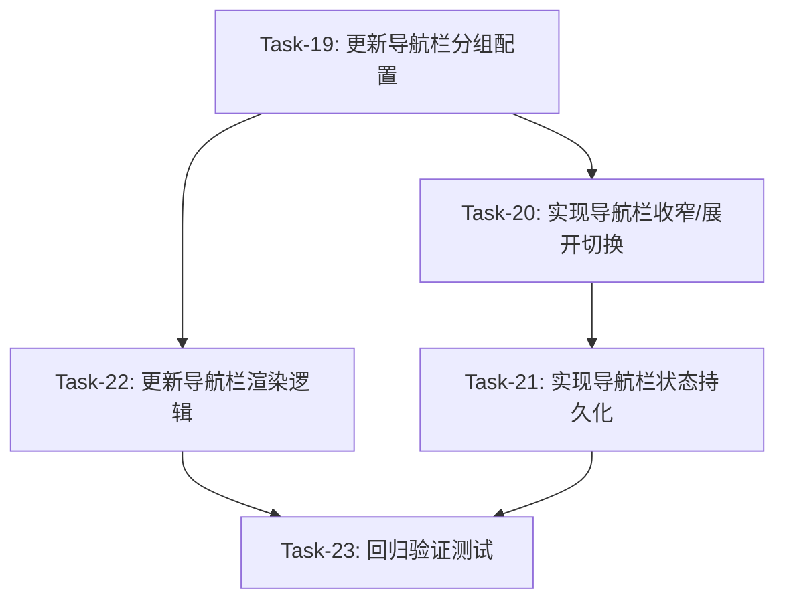

# 前端优化 — 变更任务计划 CR-001

## 1. 变更概览

**CR编号**: CR-001
**变更标题**: 导航栏分组重构和收窄功能
**变更日期**: 2026-08-31
**变更类型**: 扩展
**总任务数**: 5 个
**预计总工时**: 约 4 小时

**变更内容**:
- 导航栏分组从5个改为8个
- 导航栏展开/收窄切换功能
- 导航栏状态持久化到配置文件

---

## 2. 任务列表

### Task-19: 更新导航栏分组配置

**通俗解释**：把导航栏从5个分组改成8个分组，让用户能更快速找到需要的功能。

**做什么**：
- 修改 `config.json` 的 `function_groups` 配置
- 重新划分功能分组（基础功能、直播选项、互动设置、AI对话、高级功能、系统设置、运行状态、色彩模式）
- 更新功能项到新的分组中

**涉及文件**：
- `config.json`

**参考**: AC-001

**依赖**: 无

**预估工时**: 30 分钟

**验证标准**（TDD RED 阶段直接转化为测试用例）：
- [x] config.json 中 function_groups 包含 8 个分组
- [x] 每个分组有对应的图标
- [x] 功能项正确分配到新分组中
- [x] 系统设置分组包含登录、API等系统级配置
- [x] 运行状态分组显示系统运行状态
- [x] 色彩模式分组显示主题切换

---

### Task-20: 实现导航栏收窄/展开切换

**通俗解释**：用户点击按钮，导航栏可以收窄只显示图标，节省屏幕空间；再点击可以展开显示完整文字。

**做什么**：
- 修改导航栏渲染逻辑，支持只显示图标模式
- 添加展开/收窄切换按钮
- 收窄时只显示图标，展开时显示图标+文字
- 切换时更新 CSS 样式（宽度从 200px 变为 60px）

**涉及文件**：
- `frontend/ui/layout.py`

**参考**: AC-011, AC-018

**依赖**: Task-19

**预估工时**: 60 分钟

**验证标准**（TDD RED 阶段直接转化为测试用例）：
- [x] 点击收窄按钮，导航栏宽度变为 60px
- [x] 收窄状态下，只显示图标，不显示文字
- [x] 点击展开按钮，导航栏宽度恢复 200px
- [x] 展开状态下，显示图标+文字
- [x] 展开/收窄切换即时生效

---

### Task-21: 实现导航栏状态持久化

**通俗解释**：用户把导航栏收窄后，下次打开网页还是收窄状态，不用每次都调整。

**做什么**：
- 导航栏状态保存到 config.json 的 `drawer_mini` 字段
- 页面加载时从 config.json 读取导航栏状态
- 应用保存的导航栏状态

**涉及文件**：
- `frontend/ui/layout.py`
- `config.json`

**参考**: AC-016

**依赖**: Task-20

**预估工时**: 45 分钟

**验证标准**（TDD RED 阶段直接转化为测试用例）：
- [x] 收窄导航栏后，config.json 中 drawer_mini = true
- [x] 展开导航栏后，config.json 中 drawer_mini = false
- [x] 刷新页面后，导航栏状态保持
- [x] 关闭浏览器重新打开，导航栏状态保持

---

### Task-22: 更新导航栏渲染逻辑

**通俗解释**：让导航栏能够根据新的8个分组正确显示，并支持收窄模式。

**做什么**：
- 修改 `create_navigation_groups()` 方法支持8个分组
- 为每个分组添加对应的图标
- 修改导航项渲染逻辑，支持只显示图标模式
- 更新分组选中状态的样式

**涉及文件**：
- `frontend/ui/layout.py`

**参考**: AC-001

**依赖**: Task-19

**预估工时**: 60 分钟

**验证标准**（TDD RED 阶段直接转化为测试用例）：
- [x] 导航栏显示8个功能分组
- [x] 每个分组有对应图标（如：基础功能用settings，直播选项用live_tv）
- [x] 点击分组后，该分组高亮显示
- [x] 收窄模式下，只显示图标
- [x] 展开模式下，显示图标+文字

---

### Task-23: 回归验证测试

**通俗解释**：确保修改导航栏后，其他功能没有受到影响。

**做什么**：
- 运行所有现有测试
- 测试主题切换功能
- 测试系统运行/停止功能
- 测试搜索功能
- 测试配置保存功能

**涉及文件**：
- 所有前端文件
- 测试文件

**参考**: 所有 AC

**依赖**: Task-22

**预估工时**: 45 分钟

**验证标准**（TDD RED 阶段直接转化为测试用例）：
- [x] 所有现有测试通过
- [x] 深色/浅色主题切换正常工作
- [x] 导航栏折叠/展开正常工作
- [x] 功能启用/禁用正常工作
- [x] 配置保存（自动/手动）正常工作
- [x] 搜索功能正常工作
- [x] 系统运行/停止正常工作

---

## 3. 依赖关系图

---

## 4. AC 覆盖总表

| AC 编号 | 验收标准概述 | 承接任务 | 验证方式 |
|---------|-------------|---------|---------|
| AC-001 | 左侧导航栏显示8个功能分组 | Task-19, Task-22 | 页面加载后检查导航栏 |
| AC-011 | 导航栏折叠（收窄） | Task-20 | 点击按钮检查收窄 |
| AC-016 | 导航栏状态持久化 | Task-21 | 刷新页面检查状态 |
| AC-018 | 导航栏展开/收窄切换 | Task-20 | 点击按钮检查切换 |

---

## 5. 完成定义

- [x] 所有任务的验证标准（测试用例）通过
- [x] AC 覆盖总表中每条 AC 的验证方式已执行并通过
- [x] 导航栏显示8个功能分组
- [x] 导航栏收窄/展开切换正常工作
- [x] 导航栏状态持久化到配置文件
- [x] 现有功能不受影响（回归测试通过）
