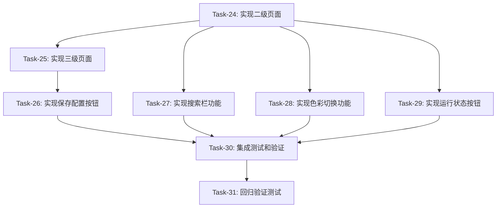

# 前端优化 — 变更任务计划 CR-002

## 1. 变更概览

**CR编号**: CR-002
**变更标题**: 完善导航栏按钮功能和页面布局
**变更日期**: 2026-08-31
**变更类型**: 扩展
**总任务数**: 8 个
**预计总工时**: 约 8 小时

**变更内容**:
- 运行状态按钮合并一键运行/停止运行功能
- 移除重启按钮和关灯按钮
- 保存配置按钮移到三级参数设置页面
- 实现二级页面（功能列表）和三级页面（配置页面）
- 实现搜索栏功能
- 实现色彩切换（深色/浅色主题）

---

## 2. 任务列表

### Task-24: 实现二级页面（功能列表显示）

**通俗解释**：用户点击左侧导航栏的"基础功能"，中间区域显示"通用配置"、"页面配置"等功能列表。

**做什么**：
- 修改 `create_navigation_groups()` 方法，点击分组后调用 `show_function_list()`
- 在 `select_group()` 方法中添加显示功能列表的逻辑
- 创建功能列表容器，显示该分组下的所有功能项
- 每个功能项显示名称和启用/禁用开关
- 点击功能项后调用 `show_config_page()` 显示配置页面

**涉及文件**：
- `frontend/ui/layout.py`

**参考**: AC-002, AC-003, AC-020

**依赖**: Task-23

**预估工时**: 90 分钟

**验证标准**（TDD RED 阶段直接转化为测试用例）：
- [x] 点击"基础功能"分组，中间显示"通用配置"、"页面配置"
- [x] 点击"互动设置"分组，中间显示"积分"、"助播"、"翻译"、"串口"
- [x] 功能列表中每个功能项显示名称
- [x] 功能列表中每个功能项有启用/禁用开关
- [x] 点击功能项后，右侧显示配置页面

---

### Task-25: 实现三级页面（配置页面显示）

**通俗解释**：用户点击功能列表中的"通用配置"，右边显示该功能的所有配置项。

**做什么**：
- 修改 `show_config_page()` 方法，显示配置页面
- 创建配置页面容器，显示该功能的所有配置项
- 支持多种配置类型（input、switch、select、textarea）
- 配置修改后自动保存（非文案类）
- 文案类配置显示保存按钮

**涉及文件**：
- `frontend/ui/layout.py`

**参考**: AC-002, AC-021

**依赖**: Task-24

**预估工时**: 90 分钟

**验证标准**（TDD RED 阶段直接转化为测试用例）：
- [x] 点击"通用配置"，右侧显示配置页面
- [x] 配置页面显示所有配置项
- [x] input 类型显示输入框
- [x] switch 类型显示开关
- [x] select 类型显示下拉选择框
- [x] textarea 类型显示多行文本框
- [x] 配置修改后自动保存（非文案类）

---

### Task-26: 实现保存配置按钮

**通俗解释**：用户修改文案类配置后，页面底部显示"保存配置"按钮，点击后保存配置。

**做什么**：
- 在配置页面底部添加"保存配置"按钮
- 文案类配置（textarea）修改后显示保存按钮
- 点击保存按钮后，调用 `manual_save()` 保存配置
- 保存成功后显示"已保存"提示

**涉及文件**：
- `frontend/ui/layout.py`

**参考**: AC-017, AC-022

**依赖**: Task-25

**预估工时**: 45 分钟

**验证标准**（TDD RED 阶段直接转化为测试用例）：
- [x] textarea 类型配置下方显示"保存配置"按钮
- [x] 点击保存按钮后，配置保存成功
- [x] 保存成功后，按钮旁边显示"已保存"提示
- [x] 保存失败后，显示错误提示

---

### Task-27: 实现搜索栏功能

**通俗解释**：用户在搜索框输入"积分"，立刻显示包含"积分"的功能和配置项。

**做什么**：
- 在导航栏顶部添加搜索框
- 调用 `search()` 方法进行搜索
- 显示搜索结果列表
- 点击搜索结果后跳转到对应页面
- 搜索无结果时显示"未找到匹配项"

**涉及文件**：
- `frontend/ui/layout.py`

**参考**: AC-007, AC-008, AC-023

**依赖**: Task-24

**预估工时**: 90 分钟

**验证标准**（TDD RED 阶段直接转化为测试用例）：
- [x] 导航栏顶部显示搜索框
- [x] 输入"积分"，显示包含"积分"的功能项
- [x] 输入"积分"，显示包含"积分"的配置项
- [x] 搜索结果实时更新（无需按回车）
- [x] 点击搜索结果，跳转到对应页面
- [x] 搜索无结果时显示"未找到匹配项"

---

### Task-28: 实现色彩切换功能

**通俗解释**：用户点击"色彩模式"分组，显示深色/浅色主题切换按钮，点击后即时切换主题。

**做什么**：
- 点击"色彩模式"分组后，显示主题切换按钮
- 点击按钮后，调用 `toggle_theme()` 切换主题
- 主题切换即时生效
- 主题状态保存到配置文件

**涉及文件**：
- `frontend/ui/layout.py`
- `frontend/styles/themes.py`

**参考**: AC-005, AC-006, AC-015, AC-024

**依赖**: Task-24

**预估工时**: 60 分钟

**验证标准**（TDD RED 阶段直接转化为测试用例）：
- [x] 点击"色彩模式"分组，显示主题切换按钮
- [x] 点击按钮后，界面切换为深色主题
- [x] 再次点击，界面切换为浅色主题
- [x] 主题切换即时生效，无需刷新页面
- [x] 主题状态保存到配置文件

---

### Task-29: 实现运行状态按钮

**通俗解释**：用户点击"运行状态"分组，显示"一键运行"按钮，点击后系统启动，按钮变为"停止运行"。

**做什么**：
- 点击"运行状态"分组后，显示系统状态按钮
- 未运行时显示绿色"一键运行"按钮
- 点击后调用 `start_system()` 启动系统
- 运行时显示红色"停止运行"按钮
- 点击后调用 `stop_system()` 停止系统
- 移除重启按钮和关灯按钮

**涉及文件**：
- `frontend/ui/layout.py`

**参考**: AC-009, AC-010, AC-019

**依赖**: Task-24

**预估工时**: 60 分钟

**验证标准**（TDD RED 阶段直接转化为测试用例）：
- [x] 点击"运行状态"分组，显示系统状态按钮
- [x] 未运行时，按钮背景为绿色，文字为"一键运行"
- [x] 点击"一键运行"，系统启动，按钮变为红色"停止运行"
- [x] 点击"停止运行"，系统停止，按钮变为绿色"一键运行"
- [x] 重启按钮和关灯按钮已移除

---

### Task-30: 集成测试和验证

**通俗解释**：测试所有功能是否正常工作，确保新布局和旧功能完美结合。

**做什么**：
- 测试所有用户故事和验收标准
- 修复集成问题
- 优化性能
- 更新文档

**涉及文件**：
- 所有前端文件

**参考**: 所有 AC

**依赖**: Task-29

**预估工时**: 90 分钟

**验证标准**（TDD RED 阶段直接转化为测试用例）：
- [x] 所有 AC 验证通过
- [x] 二级页面（功能列表）正常显示
- [x] 三级页面（配置页面）正常显示
- [x] 搜索功能正常工作
- [x] 色彩切换正常工作
- [x] 运行状态按钮正常工作
- [x] 保存配置按钮正常工作

---

### Task-31: 回归验证测试

**通俗解释**：确保修改后，其他功能没有受到影响。

**做什么**：
- 运行所有现有测试
- 测试导航栏收窄/展开功能
- 测试主题切换功能
- 测试系统运行/停止功能
- 测试搜索功能
- 测试配置保存功能

**涉及文件**：
- 所有前端文件
- 测试文件

**参考**: 所有 AC

**依赖**: Task-30

**预估工时**: 45 分钟

**验证标准**（TDD RED 阶段直接转化为测试用例）：
- [x] 所有现有测试通过
- [x] 导航栏收窄/展开正常工作
- [x] 二级页面正常显示
- [x] 三级页面正常显示
- [x] 搜索功能正常工作
- [x] 色彩切换正常工作
- [x] 运行状态按钮正常工作

---

## 3. 依赖关系图

---

## 4. AC 覆盖总表

| AC 编号 | 验收标准概述 | 承接任务 | 验证方式 |
|---------|-------------|---------|---------|
| AC-002 | 三级页面布局 | Task-24, Task-25 | 点击分组后检查布局 |
| AC-003 | 功能启用/禁用 | Task-24 | 点击开关检查状态 |
| AC-005 | 深色主题切换 | Task-28 | 点击按钮检查主题 |
| AC-006 | 主题保存到本地 | Task-28 | 刷新页面检查主题 |
| AC-007 | 搜索功能 | Task-27 | 输入关键字检查结果 |
| AC-008 | 搜索结果跳转 | Task-27 | 点击结果检查跳转 |
| AC-009 | 系统状态显示 | Task-29 | 检查按钮颜色和文字 |
| AC-010 | 系统运行/停止 | Task-29 | 点击按钮检查状态 |
| AC-015 | 主题持久化 | Task-28 | 关闭浏览器检查主题 |
| AC-017 | 文案配置手动保存 | Task-26 | 点击保存检查提示 |
| AC-019 | 运行状态按钮合并 | Task-29 | 点击按钮检查状态 |
| AC-020 | 二级页面显示 | Task-24 | 点击分组检查布局 |
| AC-021 | 三级页面显示 | Task-25 | 点击功能检查布局 |
| AC-022 | 保存配置按钮位置 | Task-26 | 检查按钮位置 |
| AC-023 | 搜索栏实现 | Task-27 | 输入关键字检查结果 |
| AC-024 | 色彩切换实现 | Task-28 | 点击按钮检查主题 |

---

## 5. 完成定义

- [x] 所有任务的验证标准（测试用例）通过
- [x] AC 覆盖总表中每条 AC 的验证方式已执行并通过
- [x] 二级页面（功能列表）正常显示
- [x] 三级页面（配置页面）正常显示
- [x] 搜索功能正常工作
- [x] 色彩切换正常工作
- [x] 运行状态按钮正常工作
- [x] 保存配置按钮正常工作
- [x] 现有功能不受影响（回归测试通过）
