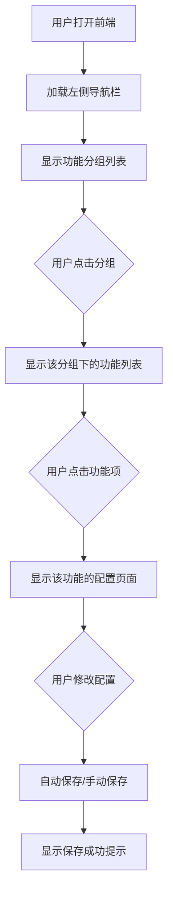
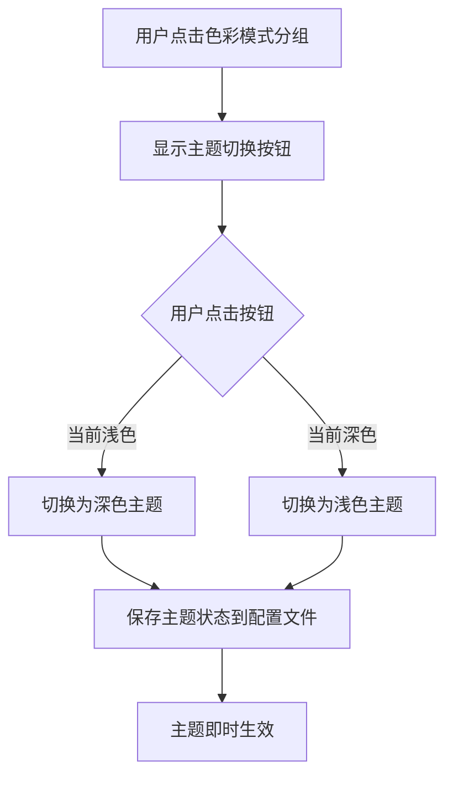

# 前端优化 — 技术设计文档

## 1. 设计概要

**功能描述**：重构 WebUI 前端界面，采用简约现代的苹果风格，左侧导航栏 + 三级页面布局，深色/浅色可切换主题，功能清晰分组，配置项规整美观。

**影响范围**：
- `webui.py` — 主前端文件（完全重构）
- `utils/config.py` — 配置管理（新增导航栏状态保存）
- `config.json` — 配置文件（新增 UI 相关配置）

**技术难点**：
- 三级页面布局的状态管理
- 搜索功能的实时过滤和高亮
- 主题切换的即时生效和持久化

**外部依赖**：无

---

## 2. 架构概览

### 2.1 整体架构

```
┌─────────────────────────────────────────────────────────────┐
│                      NiceGUI 前端                           │
├─────────────────────────────────────────────────────────────┤
│  ┌─────────────┐  ┌─────────────┐  ┌─────────────────────┐  │
│  │ 左侧导航栏  │  │ 功能列表    │  │ 配置页面            │  │
│  │             │  │             │  │                     │  │
│  │ • 搜索框    │  │ • 功能项    │  │ • 功能描述          │  │
│  │ • 功能分组  │  │ • 启用开关  │  │ • 配置项            │  │
│  │ • 主题切换  │  │             │  │ • 保存按钮(文案类)  │  │
│  │ • 系统状态  │  │             │  │                     │  │
│  └─────────────┘  └─────────────┘  └─────────────────────┘  │
└─────────────────────────────────────────────────────────────┘
                              │
                              ▼
┌─────────────────────────────────────────────────────────────┐
│                    Config 配置管理                           │
├─────────────────────────────────────────────────────────────┤
│  • config.json — 主配置文件                                  │
│  • localStorage — 主题和导航栏状态                           │
└─────────────────────────────────────────────────────────────┘
```

### 2.2 页面切换流程



---

## 3. 技术选型

### 3.1 前端框架

**选择**：NiceGUI（现有框架）

**理由**：
1. 现有代码已使用 NiceGUI，无需重写
2. Python 全栈，降低复杂度
3. 内置 Material Design 组件，支持自定义 CSS
4. 内置深色/浅色主题切换
5. 支持响应式布局

### 3.2 布局方案

**选择**：`ui.drawer()` + `ui.splitter()` + `ui.stepper()`

**理由**：
1. `ui.drawer()` — 实现左侧导航栏，支持折叠
2. `ui.splitter()` — 实现中间功能列表 + 右侧配置页面
3. `ui.stepper()` — 实现三级页面导航

### 3.3 主题方案

**选择**：`ui.dark_mode()` + CSS 变量

**理由**：
1. NiceGUI 内置主题切换，无需自定义
2. CSS 变量实现主题色统一管理
3. localStorage 持久化主题状态

### 3.4 搜索方案

**选择**：`ui.input()` + JavaScript 过滤

**理由**：
1. 实时搜索，无需刷新页面
2. JavaScript 实现高亮匹配关键字
3. 支持搜索功能名称、配置项名称、配置项值

---

## 4. 详细设计

### 4.1 主布局结构

```python
# 主布局实现
from nicegui import ui

# 主题管理
dark_mode = ui.dark_mode()

# 左侧导航栏
with ui.left_drawer(value=True, bordered=True, width=200) as left_drawer:
    # 搜索框
    search_input = ui.input(placeholder="搜索配置...", on_change=lambda e: search_configs(e.value))
    
    # 功能分组列表
    with ui.column():
        ui.button("基础设置", on_click=lambda: show_group("basic"))
        ui.button("直播互动", on_click=lambda: show_group("live"))
        ui.button("AI 对话", on_click=lambda: show_group("ai"))
        ui.button("音频设置", on_click=lambda: show_group("audio"))
        ui.button("高级功能", on_click=lambda: show_group("advanced"))
    
    # 底部固定区域
    with ui.page_sticky(position='bottom-left'):
        ui.button("主题切换", on_click=toggle_theme)
        ui.button("导航栏折叠", on_click=toggle_drawer)
        ui.button("运行系统", on_click=toggle_system)

# 主内容区
with ui.splitter() as splitter:
    with splitter.before:
        # 功能列表
        ui.list()
    with splitter.after:
        # 配置页面
        ui.card()
```

### 4.2 主题切换实现

```python
# 主题切换
def toggle_theme():
    """切换深色/浅色主题"""
    if dark_mode.value:
        dark_mode.set_light()
        ui.run_javascript("localStorage.setItem('theme', 'light')")
    else:
        dark_mode.set_dark()
        ui.run_javascript("localStorage.setItem('theme', 'dark')")

# 初始化主题
def init_theme():
    """从 localStorage 加载主题"""
    theme = ui.run_javascript("return localStorage.getItem('theme')")
    if theme == 'dark':
        dark_mode.set_dark()
    else:
        dark_mode.set_light()
```

### 4.3 导航栏折叠实现

```python
# 导航栏折叠
drawer_mini = False

def toggle_drawer():
    """切换导航栏折叠状态"""
    global drawer_mini
    drawer_mini = not drawer_mini
    left_drawer.props(f'mini={drawer_mini}')
    
    # 保存状态到配置文件
    config.set("webui", "drawer_mini", drawer_mini)
    
    # 更新按钮图标
    if drawer_mini:
        drawer_toggle_button.props('icon=chevron_right')
    else:
        drawer_toggle_button.props('icon=chevron_left')
```

### 4.4 搜索功能实现

```python
# 搜索功能
def search_configs(keyword: str):
    """实时搜索配置项"""
    if not keyword:
        clear_search_results()
        return
    
    results = []
    for group in config_groups:
        for item in group.items:
            # 搜索功能名称、配置项名称、配置项值
            if (keyword.lower() in item.name.lower() or 
                keyword.lower() in str(item.value).lower()):
                results.append(item)
    
    display_search_results(results, keyword)

def display_search_results(results: list, keyword: str):
    """显示搜索结果，高亮匹配关键字"""
    with search_results_container:
        search_results_container.clear()
        if not results:
            ui.label("未找到匹配项")
            return
        
        for item in results:
            # 高亮匹配关键字
            highlighted_name = item.name.replace(keyword, f'<mark>{keyword}</mark>')
            ui.button(highlighted_name, on_click=lambda: navigate_to_item(item))
```

### 4.5 三级页面布局实现

```python
# 三级页面布局
def show_group(group_name: str):
    """显示功能分组下的功能列表"""
    # 清空功能列表
    function_list_container.clear()
    
    # 获取该分组下的功能
    functions = get_functions_by_group(group_name)
    
    with function_list_container:
        for func in functions:
            with ui.card():
                with ui.row():
                    ui.label(func.name)
                    ui.switch(
                        value=func.enabled,
                        on_change=lambda e, f=func: toggle_function(f, e.value)
                    )

def show_config_page(function_name: str):
    """显示功能的配置页面"""
    # 清空配置页面
    config_page_container.clear()
    
    # 获取功能配置
    func = get_function_by_name(function_name)
    
    with config_page_container:
        ui.label(func.description)
        
        for config_item in func.configs:
            with ui.card():
                ui.label(config_item.label)
                
                if config_item.type == "input":
                    ui.input(
                        value=config_item.value,
                        on_change=lambda e, item=config_item: auto_save(item, e.value)
                    )
                elif config_item.type == "switch":
                    ui.switch(
                        value=config_item.value,
                        on_change=lambda e, item=config_item: auto_save(item, e.value)
                    )
                elif config_item.type == "select":
                    ui.select(
                        options=config_item.options,
                        value=config_item.value,
                        on_change=lambda e, item=config_item: auto_save(item, e.value)
                    )
                elif config_item.type == "textarea":
                    ui.textarea(
                        value=config_item.value,
                        on_change=lambda e, item=config_item: auto_save(item, e.value)
                    )
                    # 文案类需要保存按钮
                    ui.button("保存", on_click=lambda: save_textarea(config_item))
```

### 4.6 配置保存实现

```python
# 配置保存
def auto_save(config_item, value):
    """自动保存配置（非文案类）"""
    try:
        config.set(config_item.path, value)
        ui.notify("已保存", type="positive")
    except Exception as e:
        ui.notify(f"保存失败: {e}", type="negative")

def save_textarea(config_item):
    """手动保存文案类配置"""
    try:
        # 获取 textarea 的值
        value = config_item.element.value
        config.set(config_item.path, value)
        
        # 显示保存成功提示
        config_item.save_button.props('icon=check')
        ui.notify("已保存", type="positive")
        
        # 1 秒后恢复按钮图标
        ui.timer(1.0, lambda: config_item.save_button.props('icon=save'))
    except Exception as e:
        ui.notify(f"保存失败: {e}", type="negative")
```

### 4.7 系统状态实现

```python
# 系统状态
system_running = False

def toggle_system():
    """切换系统运行状态"""
    global system_running
    
    if system_running:
        stop_system()
        system_running = False
        system_button.props('icon=play_arrow')
        system_button.style('background-color: #4caf50')  # 绿色
        system_button.text = "运行系统"
    else:
        start_system()
        system_running = True
        system_button.props('icon=stop')
        system_button.style('background-color: #f44336')  # 红色
        system_button.text = "停止运行"

def update_system_status():
    """定时更新系统状态"""
    global system_running
    # 检查系统是否在运行
    system_running = check_system_running()
    
    if system_running:
        system_button.props('icon=stop')
        system_button.style('background-color: #f44336')
        system_button.text = "停止运行"
    else:
        system_button.props('icon=play_arrow')
        system_button.style('background-color: #4caf50')
        system_button.text = "运行系统"

# 定时更新状态
ui.timer(1.0, update_system_status)
```

---

## 5. 样式设计

### 5.1 CSS 变量定义

```python
# CSS 变量
ui.add_head_html('''
<style>
  :root {
    /* 浅色主题 */
    --bg-color: #ffffff;
    --card-bg: #f5f5f5;
    --text-color: #333333;
    --text-secondary: #666666;
    --border-color: #e0e0e0;
    --primary-color: #1976d2;
    --success-color: #4caf50;
    --error-color: #f44336;
  }
  
  .dark {
    /* 深色主题 */
    --bg-color: #1a1a1a;
    --card-bg: #2d2d2d;
    --text-color: #ffffff;
    --text-secondary: #e0e0e0;
    --border-color: #404040;
    --primary-color: #64b5f6;
    --success-color: #81c784;
    --error-color: #e57373;
  }
  
  .card {
    background-color: var(--card-bg);
    border-radius: 12px;
    box-shadow: 0 2px 8px rgba(0, 0, 0, 0.1);
    padding: 16px;
    margin: 8px;
  }
  
  .config-item {
    margin-bottom: 16px;
  }
  
  .config-label {
    font-size: 14px;
    font-weight: 500;
    color: var(--text-color);
    margin-bottom: 8px;
  }
  
  .config-input {
    width: 100%;
  }
  
  .search-highlight {
    background-color: #ffeb3b;
    padding: 2px 4px;
    border-radius: 4px;
  }
</style>
''')
```

### 5.2 卡片样式

```python
# 卡片样式
card_style = '''
  background-color: var(--card-bg);
  border-radius: 12px;
  box-shadow: 0 2px 8px rgba(0, 0, 0, 0.1);
  padding: 16px;
  margin: 8px;
'''
```

---

## 6. 数据结构

### 6.1 功能分组数据

```python
# 功能分组定义
config_groups = [
    {
        "name": "基础设置",
        "icon": "settings",
        "functions": [
            {
                "name": "平台配置",
                "enabled": True,
                "description": "配置直播平台参数",
                "configs": [
                    {"label": "平台", "type": "select", "path": "platform", "options": ["bilibili", "douyin", "ks"]},
                    {"label": "房间号", "type": "input", "path": "room_display_id"},
                ]
            },
            # ...
        ]
    },
    # ...
]
```

### 6.2 配置项数据

```python
# 配置项定义
config_items = {
    "platform": {
        "label": "平台",
        "type": "select",
        "options": ["bilibili", "douyin", "ks"],
        "value": "bilibili",
        "group": "基础设置"
    },
    "room_display_id": {
        "label": "房间号",
        "type": "input",
        "value": "",
        "group": "基础设置"
    },
    # ...
}
```

---

## 7. API 设计

### 7.1 配置保存 API

```python
# 配置保存
@app.post("/api/config/save")
async def save_config(request: Request):
    """保存配置项"""
    data = await request.json()
    config.set(data["path"], data["value"])
    return {"success": True}
```

### 7.2 系统控制 API

```python
# 系统控制
@app.post("/api/system/toggle")
async def toggle_system():
    """切换系统运行状态"""
    if system_running:
        stop_system()
        return {"status": "stopped"}
    else:
        start_system()
        return {"status": "running"}
```

---

## 8. 异常处理

### 8.1 配置保存失败

```python
try:
    config.set(path, value)
    ui.notify("已保存", type="positive")
except Exception as e:
    ui.notify(f"保存失败: {e}", type="negative")
    # 回滚到修改前的值
    config_item.element.value = config.get(path)
```

### 8.2 搜索无结果

```python
if not results:
    ui.label("未找到匹配项")
    return
```

---

## 9. 验收标准映射

| AC | 设计点 | 实现方式 |
|-----|--------|----------|
| AC-001 | 左侧导航栏显示功能分组 | `ui.drawer()` + 功能分组按钮 |
| AC-002 | 三级页面布局 | `ui.splitter()` + `ui.stepper()` |
| AC-003 | 功能启用/禁用 | `ui.switch()` + `on_change` 事件 |
| AC-004 | 功能禁用时隐藏配置 | 动态清空配置页面容器 |
| AC-005 | 深色主题切换 | `ui.dark_mode()` |
| AC-006 | 主题保存到本地 | `localStorage` |
| AC-007 | 搜索功能 | `ui.input()` + JavaScript 过滤 |
| AC-008 | 搜索结果跳转 | `on_click` 事件 + 页面导航 |
| AC-009 | 系统状态显示 | `ui.button()` + 动态样式 |
| AC-010 | 系统运行/停止 | `ui.button()` + `on_click` 事件 |
| AC-011 | 导航栏折叠 | `ui.drawer(mini=True)` |
| AC-012 | 配置保存失败 | `try/except` + `ui.notify()` |
| AC-013 | 搜索无结果 | 条件判断 + 提示文本 |
| AC-014 | 功能禁用保留配置 | 配置数据独立存储 |
| AC-015 | 主题持久化 | `localStorage` + 初始化加载 |
| AC-016 | 导航栏状态持久化 | `config.json` |
| AC-017 | 文案配置手动保存 | `ui.button()` + `on_click` 事件 |

---

## 10. 实现步骤

### 阶段 1：基础布局
1. 创建主布局结构（左侧导航栏 + 右侧内容区）
2. 实现导航栏折叠功能
3. 实现主题切换功能

### 阶段 2：功能分组
1. 创建功能分组数据结构
2. 实现功能列表显示
3. 实现功能启用/禁用开关

### 阶段 3：配置页面
1. 创建配置项数据结构
2. 实现配置页面显示
3. 实现配置保存功能

### 阶段 4：搜索功能
1. 实现搜索框
2. 实现搜索过滤逻辑
3. 实现搜索结果高亮

### 阶段 5：系统状态
1. 实现系统状态显示
2. 实现系统运行/停止功能
3. 实现状态定时更新

---

## 附录：变更记录

| 日期 | 变更内容 | 原因 |
|------|---------|------|
| 2026-08-29 | 初始版本 | — |
| 2026-08-31 | 新增二级/三级页面布局、搜索栏、色彩切换、运行状态按钮的技术设计 | CR-002: 完善导航栏按钮功能和页面布局 |

---

## 11. 二级/三级页面布局设计

### 11.1 页面结构

```
┌─────────────────────────────────────────────────────────────┐
│                      NiceGUI 前端                           │
├─────────────────────────────────────────────────────────────┤
│  ┌─────────────┐  ┌─────────────┐  ┌─────────────────────┐  │
│  │ 左侧导航栏  │  │ 功能列表    │  │ 配置页面            │  │
│  │             │  │ (二级页面)  │  │ (三级页面)          │  │
│  │ • 搜索框    │  │             │  │                     │  │
│  │ • 功能分组  │  │ • 功能项    │  │ • 功能描述          │  │
│  │ • 主题切换  │  │ • 启用开关  │  │ • 配置项            │  │
│  │ • 系统状态  │  │             │  │ • 保存按钮(文案类)  │  │
│  └─────────────┘  └─────────────┘  └─────────────────────┘  │
└─────────────────────────────────────────────────────────────┘
```

### 11.2 页面切换流程


### 11.3 实现代码示例

```python
# 二级页面：功能列表
def show_function_list(self, group_name: str):
    """显示功能列表"""
    # 清除之前的内容
    if self.function_list_container is not None:
        self.function_list_container.clear()

    # 获取功能列表
    functions = self.get_group_functions(group_name)

    # 创建功能列表容器
    self.function_list_container = ui.column()

    with self.function_list_container:
        for func in functions:
            with ui.card():
                ui.label(func["name"])
                ui.switch(
                    value=func.get("enabled", True),
                    on_change=lambda e, name=func["name"]: self.toggle_function(name, e.value)
                )
                # 点击功能项显示配置页面
                ui.button("配置", on_click=lambda name=func["name"]: self.show_config_page(name))

# 三级页面：配置页面
def show_config_page(self, function_name: str):
    """显示配置页面"""
    # 清除之前的内容
    if self.config_page_container is not None:
        self.config_page_container.clear()

    # 获取配置项
    tab_key = self.function_items.get(function_name, {}).get("tab_key", function_name)
    config_items = self.config.get("webui", {}).get("config_items", {}).get(tab_key, {})

    if not config_items:
        self.config_page_container = None
        return

    # 创建配置页面容器
    self.config_page_container = ui.column()

    with self.config_page_container:
        ui.label(config_items.get("label", function_name))

        # 渲染配置项
        items = config_items.get("items", {})
        for item_name, item_config in items.items():
            item_type = item_config.get("type", "input")
            item_label = item_config.get("label", item_name)
            item_value = item_config.get("value", "")

            with ui.card():
                ui.label(item_label)

                if item_type == "input":
                    ui.input(value=str(item_value), on_change=lambda e, name=item_name: self.auto_save(tab_key, name, e.value))
                elif item_type == "switch":
                    ui.switch(value=bool(item_value), on_change=lambda e, name=item_name: self.auto_save(tab_key, name, e.value))
                elif item_type == "select":
                    options = item_config.get("options", [])
                    ui.select(options=options, value=str(item_value), on_change=lambda e, name=item_name: self.auto_save(tab_key, name, e.value))
                elif item_type == "textarea":
                    ui.textarea(value=str(item_value))
                    # 文案类需要保存按钮
                    ui.button("保存配置", on_click=lambda name=item_name, val=item_value: self.manual_save(tab_key, name, val))
```

---

## 12. 搜索栏设计

### 12.1 搜索框位置

搜索框位于导航栏顶部，功能分组按钮之前。

### 12.2 搜索流程

```mermaid
graph TD
    A[用户输入关键字] --> B[调用 search 方法]
    B --> C{搜索结果}
    C -->|有结果| D[显示搜索结果列表]
    C -->|无结果| E[显示"未找到匹配项"]
    D --> F{用户点击结果}
    F --> G[跳转到对应页面]
```

### 12.3 实现代码示例

```python
# 搜索框
with self.drawer:
    search_input = ui.input(
        placeholder="搜索配置...",
        on_change=lambda e: self.search(e.value)
    )

    # 搜索结果容器
    self.search_results_container = ui.column()

    # 功能分组按钮
    for group in function_groups:
        ui.button(group["name"], on_click=lambda g=group["name"]: self.select_group(g))

# 搜索方法
def search(self, keyword: str):
    """搜索功能和配置项"""
    self.search_keyword = keyword
    self.search_results = []

    if not keyword:
        self.search_results_container.clear()
        return

    keyword_lower = keyword.lower()

    # 搜索功能名称
    function_groups = self.config.get("webui", {}).get("function_groups", [])
    for group in function_groups:
        for func in group.get("functions", []):
            if keyword_lower in func["name"].lower():
                self.search_results.append({
                    "type": "function",
                    "name": func["name"],
                    "group": group["name"],
                    "tab_key": func.get("tab_key", "")
                })

    # 搜索配置项标签
    config_items = self.config.get("webui", {}).get("config_items", {})
    for func_name, func_config in config_items.items():
        items = func_config.get("items", {})
        for item_name, item_config in items.items():
            label = item_config.get("label", item_name)
            if keyword_lower in label.lower():
                self.search_results.append({
                    "type": "config_item",
                    "name": item_name,
                    "label": label,
                    "function": func_name,
                    "group": func_config.get("label", func_name)
                })

    # 显示搜索结果
    self.display_search_results()

def display_search_results(self):
    """显示搜索结果"""
    self.search_results_container.clear()

    with self.search_results_container:
        if not self.search_results:
            ui.label("未找到匹配项")
            return

        for result in self.search_results:
            highlighted_name = self.highlight_search_results(result["name"], self.search_keyword)
            ui.button(
                highlighted_name,
                on_click=lambda r=result: self.navigate_to_result(r)
            )
```

---

## 13. 色彩切换设计

### 13.1 主题切换流程



### 13.2 实现代码示例

```python
# 色彩切换页面
def show_color_mode_page(self):
    """显示色彩模式页面"""
    if self.config_page_container is not None:
        self.config_page_container.clear()

    self.config_page_container = ui.column()

    with self.config_page_container:
        ui.label("色彩模式")
        ui.label("选择您喜欢的主题风格")

        with ui.card():
            ui.label("当前主题")
            current_theme = self.load_theme_preference()
            ui.label(f"当前: {current_theme}")

            # 主题切换按钮
            ui.button(
                "切换为深色主题" if current_theme == "light" else "切换为浅色主题",
                on_click=self.toggle_theme
            )

# 主题切换方法
def toggle_theme(self):
    """切换深色/浅色主题"""
    if self.dark_mode is None:
        self.dark_mode = ui.dark_mode()

    # NiceGUI 的 dark_mode 是一个布尔值
    self.dark_mode.value = not self.dark_mode.value

    # 保存主题偏好
    new_theme = "dark" if self.dark_mode.value else "light"
    self.save_theme_preference(new_theme)

    # 刷新页面显示
    self.show_color_mode_page()
```

---

## 14. 运行状态按钮设计

### 14.1 按钮状态

| 系统状态 | 按钮文字 | 按钮颜色 | 点击动作 |
|---------|---------|---------|---------|
| 未运行 | 一键运行 | 绿色 (#4caf50) | 启动系统 |
| 运行中 | 停止运行 | 红色 (#f44336) | 停止系统 |

### 14.2 实现代码示例

```python
# 运行状态页面
def show_running_status_page(self):
    """显示运行状态页面"""
    if self.config_page_container is not None:
        self.config_page_container.clear()

    self.config_page_container = ui.column()

    with self.config_page_container:
        ui.label("运行状态")
        ui.label("管理系统运行状态")

        with ui.card():
            ui.label("系统状态")
            ui.label(f"当前状态: {self.system_status}")

            # 系统状态按钮
            self.system_button = ui.button(
                self.system_button_text,
                on_click=self.toggle_system
            )
            self.system_button.style(f'background-color: {self.system_button_color}')

# 系统状态切换方法
def toggle_system(self):
    """切换系统运行/停止状态"""
    if self.system_status == "running":
        self.stop_system()
    else:
        self.start_system()

    # 刷新页面显示
    self.show_running_status_page()
```

---

## 15. 保存配置按钮设计

### 15.1 按钮位置

保存配置按钮位于三级配置页面底部，仅对文案类配置（textarea）显示。

### 15.2 实现代码示例

```python
# 在配置页面中添加保存按钮
with self.config_page_container:
    for item_name, item_config in items.items():
        item_type = item_config.get("type", "input")
        item_label = item_config.get("label", item_name)
        item_value = item_config.get("value", "")

        with ui.card():
            ui.label(item_label)

            if item_type == "textarea":
                textarea = ui.textarea(value=str(item_value))
                # 文案类需要保存按钮
                save_button = ui.button(
                    "保存配置",
                    on_click=lambda name=item_name, ta=textarea: self.save_textarea_config(tab_key, name, ta.value)
                )
                # 保存状态提示
                save_status = ui.label("")

def save_textarea_config(self, function_name: str, item_name: str, value):
    """保存文案类配置"""
    try:
        self.manual_save(function_name, item_name, value)
        # 显示保存成功提示
        ui.notify("配置已保存", type="positive")
    except Exception as e:
        # 显示保存失败提示
        ui.notify(f"保存失败: {e}", type="negative")
```

